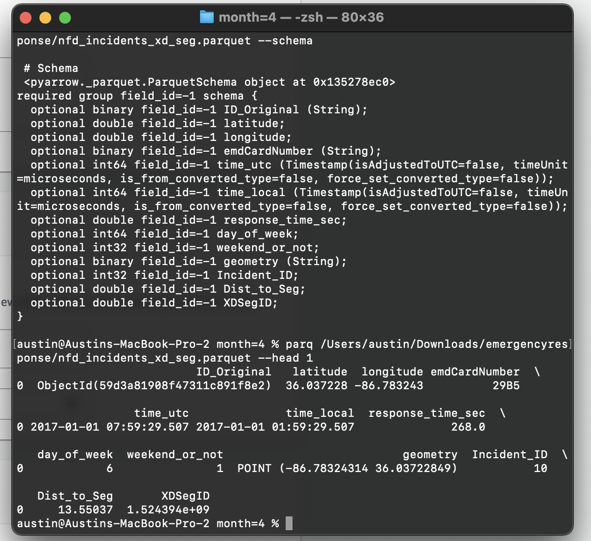
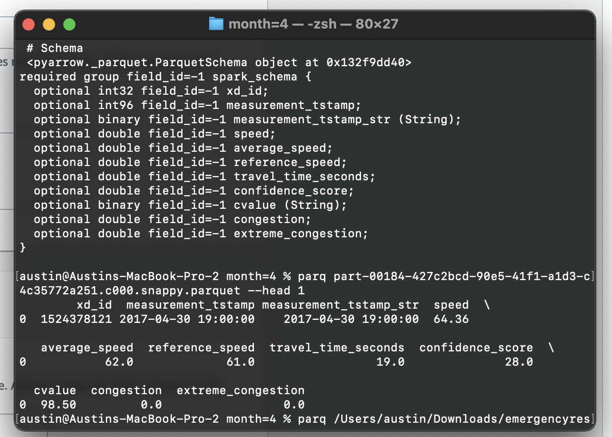
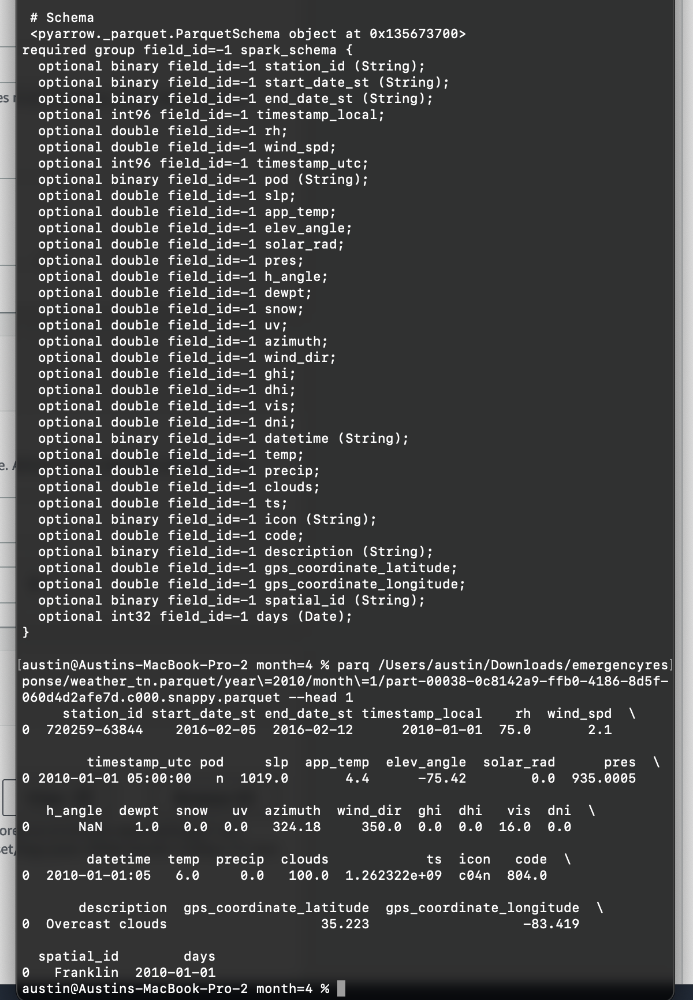

# Project-Incident-Team10

## Setup

### [YouTube](https://youtu.be/Q9TrJWjaHLo)

### Text Guide
1. Launch AWS Lab
2. Open AWS Console
3. Launch S3, create two buckets, one for storing the datasets, another for storing query results.
4. Launch Athena, create corresponding tables from the datasets.

### Creating the Tables in Athena
#### First, use the parquet CLI to view the schema of the datasets.
``` console
pip install parquet-cli
```

``` console
parq <path-to-your-parquet-file>.parquet --schema
```

The schema for the incidents, traffic, and weather datasets are as follow:
#### Incidents Schema


#### Traffic Schema


#### Weather Schema


## Now, create the actual tables in Athena

>This assumes you have already created a S3 bucket named 'vandy-bucket' where your datasets are stored.

#### nfd_incidents_xd_seg (incident)
``` sql
CREATE EXTERNAL TABLE IF NOT EXISTS `traffic-db`.`nfd_incidents_xd_seg` (
  `id_original` string,
  `latitude` double,
  `longitude` double,
  `emdcardnumber` string,
  `time_utc` bigint,
  `time_local` bigint,
  `response_time_sec` double,
  `day_of_week` int,
  `weekend_or_not` int,
  `geometry` string,
  `incident_id` int,
  `dist_to_seg` double,
  `xdsegid` double
)
ROW FORMAT SERDE 'org.apache.hadoop.hive.ql.io.parquet.serde.ParquetHiveSerDe' 
WITH SERDEPROPERTIES (
  'serialization.format' = '1'
) LOCATION 's3://vandy-bucket/nfd_incidents_xd_seg.parquet/'
TBLPROPERTIES ('has_encrypted_data'='false');
```

#### traffic-data (traffic)
``` sql
CREATE EXTERNAL TABLE IF NOT EXISTS `traffic-db`.`traffic-data` (
  `xd_id` int,
  `measurement_tstamp` bigint,
  `measurement_tstamp_str` string,
  `speed` double,
  `average_speed` double,
  `travel_time_seconds` double,
  `confidence_score` double,
  `cvalue` string,
  `congestion` double,
  `extreme_congestion` double
)
ROW FORMAT SERDE 'org.apache.hadoop.hive.ql.io.parquet.serde.ParquetHiveSerDe' 
WITH SERDEPROPERTIES (
  'serialization.format' = '1'
) LOCATION 's3://vandy-bucket/traffic.parquet/'
TBLPROPERTIES ('has_encrypted_data'='false');
```

#### weather-data (weather)
``` sql
CREATE EXTERNAL TABLE IF NOT EXISTS `traffic-db`.`weather-data` (
  `station_id` string,
  `start_date_st` string,
  `end_data_st` string,
  `timestamp_local` bigint,
  `rh` double,
  `wind_spd` double,
  `timestamp_utc` bigint,
  `pod` string,
  `slp` double,
  `app_temp` double,
  `elev_angle` double,
  `solar_rad` double,
  `pre` double,
  `h_angle` double,
  `dewpt` double,
  `snow` double,
  `uv` double,
  `azimuth` double,
  `wind_dir` double,
  `ghi` double,
  `dhi` double,
  `vis` double,
  `dni` double,
  `datetime` string,
  `temp` double,
  `precip` double,
  `clouds` double,
  `ts` double,
  `icon` string,
  `code` double,
  `description` string,
  `gps_coordinate_latitude` double,
  `gps_coordinate_longtitude` double,
  `spatial_id` string,
  `days` date
)
ROW FORMAT SERDE 'org.apache.hadoop.hive.ql.io.parquet.serde.ParquetHiveSerDe' 
WITH SERDEPROPERTIES (
  'serialization.format' = '1'
) LOCATION 's3://vandy-bucket/weather_tn.parquet/'
TBLPROPERTIES ('has_encrypted_data'='false');
```

## Run some queries to make sure your setup works

### Count number of entries in each table

#### nfd_incidents_xd_seg
``` sql
SELECT COUNT(*) FROM "traffic-db"."nfd_incidents_xd_seg";
-- result: 29765
-- time in queue: 0.175 sec
-- run time: 0.672 sec
```

#### traffic-data
``` sql
SELECT COUNT(*) FROM "traffic-db"."traffic-data";
-- result: 2949783075
-- time in queue: 0.206 sec
-- run time: 0.799 sec
```

#### weather-data
``` sql
SELECT COUNT(*) FROM "traffic-db"."weather-data";
-- result: 20792532
-- time in queue: 0.255 sec
-- Run time: 1.175 sec
```

---

## Index
To see queries performed directly on Athena and their respective analyses, go to [Report.md](./Report.md).

To see queries using boto3 in Colab, go to [incident.ipynb](./incident.ipynb)。 Please note that in order to see some of the graphs, you must open the notebook in Colab. They are not shown on GitHub.

To see joins using pandas, go to [join.ipynb](./join.ipynb).

To see some sample CSV output files, go to [output](./output/).

To see who did what work, go to [workdistribution](./workdistribution.md).