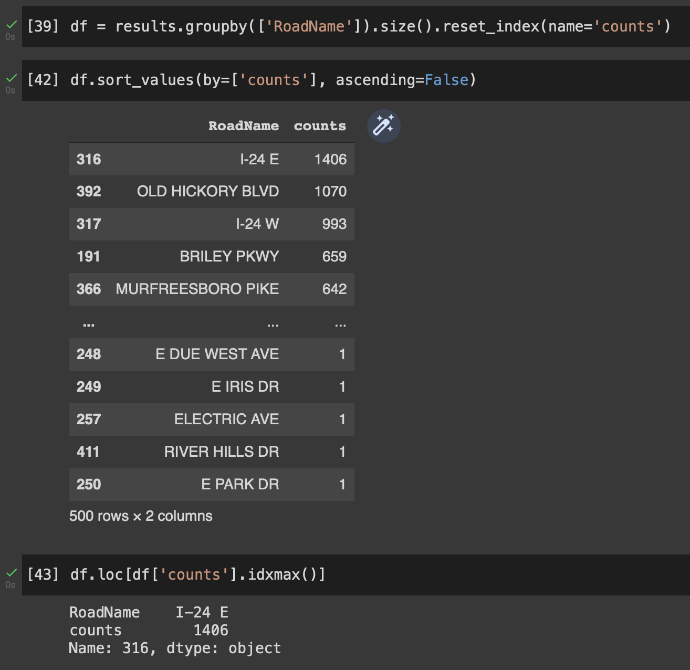
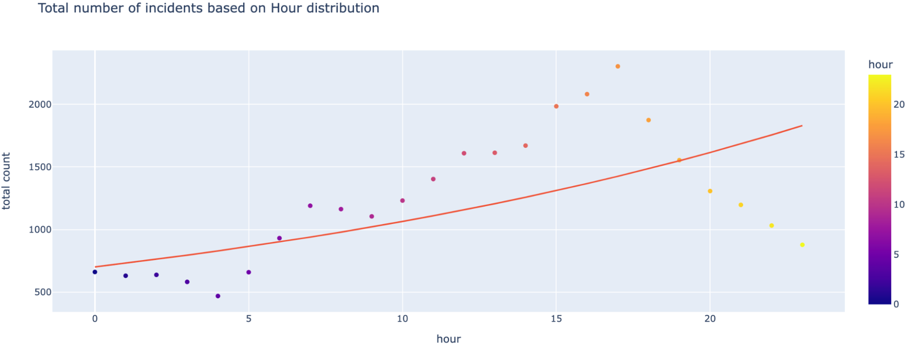
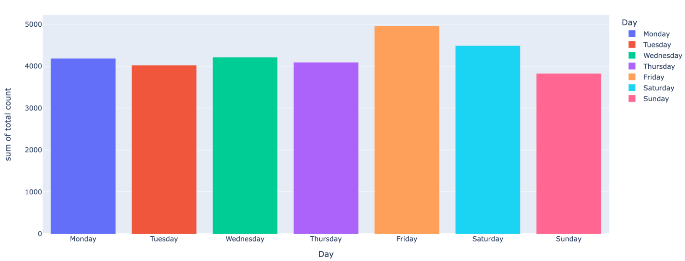
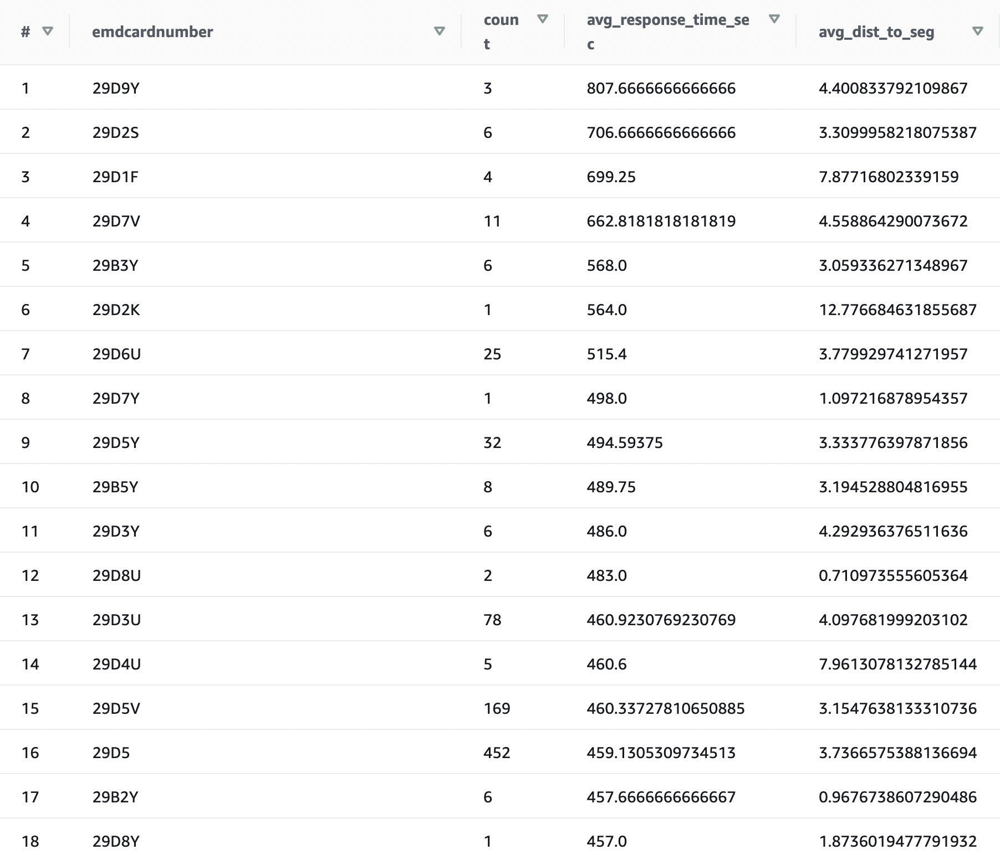
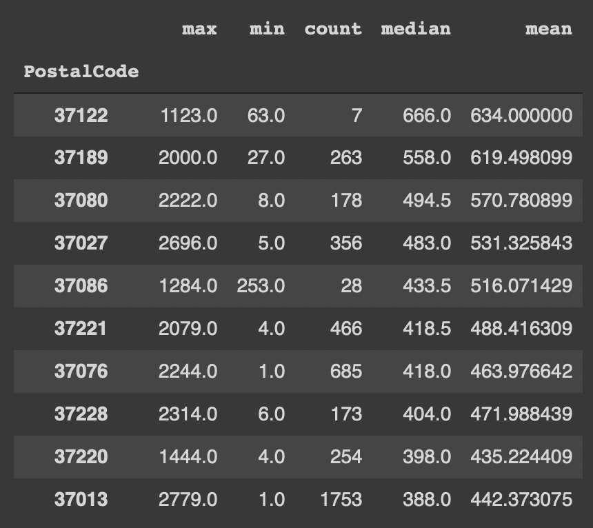

# CS 5266 Final Project Report
## Incident Reponse

Xi Sun, Austin Wang

[xi.sun@vanderbilt.edu](xi.sun@vanderbilt.edu)

[austin.w.wang@vanderbilt.edu](austin.w.wang@vanderbilt.edu)

### Spring 2022

Statement: All group members have contributed to this document.

---

## Table of Contents
1. Project Overview
2. Result Summary & Evidence
3. Division of Work
4. Future Possible Improvements

---

## Project Overview
### [Location of Repository](https://github.com/vu-topics-in-big-data-2022/Project-Incident-Team10.git)

### [Walkthrough of Setup](https://youtu.be/Q9TrJWjaHLo)

### General Description
The Incident Response Project aims to perform analysis on three datasets: incident dataset, traffic dataset, and weather dataset. In the incident dataset, we are provided with incident information including road segment ID, location of the incident (latitude, longitude), type of incidents (emdcardnumber), time of incidents (utc and local), response time, etc. In the weather dataset, we are provided with the weather data for Davidson County from the year 2010 to 2022. Useful information includes wind speed, snow, precipitation, temperature, clouds, etc. In the traffic dataset, we are provided with the traffic data for Davidson County from the year 2017 to 2022. Useful information includes the measurement time stamp, speed, congestion, etc.

The main analysis we’ve performed includes temporal and spatial analysis of incidents, the effect of time and space on response time (effect of time_local on average response_time), joining weather and traffic datasets to the incident dataset performing some corresponding queries for better analysis, and finally some graphical visualizations of our findings from querying.

### Approach / Technology Used

The size of the datasets we are provided with is greater than 20 GB. Thus, we consider uploading the datasets to AWS S3 bucket a more practical way instead of uploading the data to Google Colab local. For querying, we deployed the AWS Athena service and set up a connection between the Athena and our S3 bucket for input and output databases. We submit the query task to Athena in Colab and all the results from querying are saved in Colab and graphical visualizations are done on the results. For data visualization, we used Plotly and Geopandas to create histograms, scatter plots, and geometry plots.

---

## Result Summary

### ***The following queries assume you have completed the setup as specified in README.md***

### 1. Spatial analysis of the incidents
``` python
!pip install geopandas pandas pyarrow
import geopandas as gpd
roads=gpd.read_file('USA_Tennessee.geojson')
```

``` python
import pandas as pd
incidents=pd.read_parquet('nfd_incidents_xd_seg.parquet')
import shapely
incidents['geometry']=incidents.geometry.apply(shapely.wkt.loads)
incidents = gpd.GeoDataFrame(incidents,geometry=incidents.geometry)
```

``` python
!pip install pandas fiona shapely pyproj rtree
!pip install geopandas
results = roads.merge(incidents, on="XDSegID")
df = results.groupby(['RoadName']).size().reset_index(name='counts')
df.sort_values(by=['counts'], ascending=False)
df.loc[df['counts'].idxmax()]
```



### 2. Temporal analysis of the incidents
#### Distribution of Total Number of Incidents Based on Local Time
``` sql
SELECT HOUR(from_unixtime(time_local/1000)) AS "hour", COUNT(*) AS "count"
FROM "traffic-db"."nfd_incidents_xd_seg"
GROUP BY HOUR(from_unixtime(time_local/1000))
ORDER BY HOUR(from_unixtime(time_local/1000));
```
Visualization (Scatter Plot & OLS Regression)



Analysis: 
More incidents tend to happen at around 2pm to 7 pm, which is the afternoon period. Most incidents happen at 5 pm, which is the time where traffic are heavier because people are getting home from work.

#### Amount of Incidents Group by Day of Week
``` sql
SELECT day_of_week, COUNT(*) FROM "traffic-db"."nfd_incidents_xd_seg"
GROUP BY day_of_week
ORDER BY day_of_week;
```

**Results**

| day   | count |
| --    | --    |
| 0     | 4018  |
| 1     | 4088  |
| 2     | 4210  |
| 3     | 4182  |
| 4     | 4957  |
| 5     | 4487  |
| 6     | 3823  |

Visualization


Analysis:
The number of incidents that happened on Friday is the greatest during the week. Saturday has the second-highest number of incidents.

#### Average Count of Incidents Per Day during the Weeks

``` sql
SELECT CAST(COUNT(*) AS DOUBLE)/5 FROM "traffic-db"."nfd_incidents_xd_seg" 
WHERE weekend_or_not = 0;
-- result: 4291.0
```

#### Average Count of Incidents Per day in Weekends

``` sql
SELECT CAST(COUNT(*) AS DOUBLE)/2 FROM "traffic-db"."nfd_incidents_xd_seg" 
WHERE weekend_or_not = 1;
-- result: 4155.0
```

Analysis: On average, more incidents happen on weekdays and not on weekends.

### 3. How is the Response Time Distribution

#### Order emdcardnumber (type of incident) by descending order

this way we know what types of incidents currently tend to be neglected.

``` sql
SELECT
    emdcardnumber,
    COUNT(*) AS "count",
    AVG(response_time_sec) AS "avg_response_time_sec",
    AVG(dist_to_seg) AS "avg_dist_to_seg",
    (AVG(response_time_sec) / AVG(dist_to_seg)) AS "avg_response_to_dist_ratio"
FROM "traffic-db"."nfd_incidents_xd_seg"
WHERE
    emdcardnumber IS NOT NULL
    AND response_time_sec > 0
    AND dist_to_seg > 0
GROUP BY emdcardnumber
ORDER BY AVG(response_time_sec) DESC;
```



Analysis: 
More attention should be allocated to the types of incidents listed here. Specifically, we should probably investigate further into "29D5", since this type of incident both occurs quite frequently and has a slow average response time.

### 4. Effect of time and space on response time

#### Preliminary Statistics Based on Postal Code

The following code blocks written in Python
``` python
results = results[(results["response_time_sec"]>0) & (results["Dist_to_Seg"]>0)]
```

``` python
temp = results.groupby(['PostalCode']).response_time_sec.agg(['max', 'min', 'count', 'median', 'mean'])
```

``` python
temp
```


Further, you can sort the results.

``` python
temp.sort_values(by=['median'], ascending=False).head(10)
```



Analysis: These are the top 10 postal codes with slow response times. If we want to improve the incident response time, we should look into these neighborhoods.

#### Percentage of incidents where the street's average speed is > 50
``` sql
SELECT COUNT(*)
FROM "traffic-db"."nfd_incidents_xd_seg" incidents
JOIN "traffic-db"."traffic-data" traffic
ON incidents."xdsegid" = traffic."xd_id"
WHERE average_speed > 50;
```

```
result: 2761079432
total: 10176747655
percentage: 2761079432 / 10176747655 = 0.27131255737
```

We try to join the traffic dataset and incident dataset to get a better understanding of the relationship between the average speed of vehicles on certain road segments with the incident that happened in the same segment. We assume an average speed greater than 50 as high-speed driving and we, therefore, expect more percentage of incidents to happen on streets with an average speed greater than 50.  However, we only find about 27% of incidents happened on street with an average speed greater than 50, which does not correspond to our expectations. To improve the querying and analysis, consider further filtering the type of incidents to leave only the driving speed-related incidents for this query.

### Bonus: Even More Queries (Can Skip)
#### what's the range between the response times?
``` sql
-- filter out response times that are negative or 0, which don't quite make sense
SELECT response_time_sec FROM "traffic-db"."nfd_incidents_xd_seg"
WHERE response_time_sec > 0
ORDER BY response_time_sec ASC
LIMIT 1;
-- result: 1.0
-- time in queue: 0.205 sec
-- run time: 0.772 sec
```

``` sql
SELECT response_time_sec FROM "traffic-db"."nfd_incidents_xd_seg"
ORDER BY response_time_sec DESC
LIMIT 1;
-- result: 6493.0
-- time in queue: 0.211 sec
-- run time: 1.004 sec
```

```
As such, the range is 6493.0 - 1.0 = **6492 seconds**
```

#### Find the specific incident that had the longest response time

``` sql
SELECT incident_id
FROM
(
    SELECT response_time_sec, incident_id FROM "traffic-db"."nfd_incidents_xd_seg"
    ORDER BY response_time_sec DESC
    LIMIT 1
);
-- result: 23661
-- time in queue: 0.226 sec
-- run time: 0.877 sec
```


#### Find how many incidents occurred in the weekends
``` sql
SELECT COUNT(*) FROM "traffic-db"."nfd_incidents_xd_seg" WHERE weekend_or_not = 1;
-- result: 8310
-- time in queue: 0.198 sec
-- run time: 0.644 sec
```

#### Find how many incidents occurred during the weekdays
``` sql
SELECT COUNT(*) FROM "traffic-db"."nfd_incidents_xd_seg"
WHERE weekend_or_not = 0;
-- result: 21455
-- time in queue: 0.223 sec
-- run time: 0.967 sec
```

#### Average response time
``` sql
SELECT AVG(response_time_sec) FROM "traffic-db"."nfd_incidents_xd_seg";
-- result: 385.3213820766335
-- time in queue: 0.109 sec
-- run time: 0.559 sec
```

#### Amount of incidents grouped by emdcardnumber (the type of incident)
``` sql
SELECT emdcardnumber, COUNT(*) FROM "traffic-db"."nfd_incidents_xd_seg"
GROUP BY emdcardnumber;
```

#### Sort the hours by their amount of incidents (descending order)
``` sql
SELECT HOUR(from_unixtime(time_local/1000)) AS "hour", COUNT(*) AS "count"
FROM "traffic-db"."nfd_incidents_xd_seg"
GROUP BY HOUR(from_unixtime(time_local/1000))
ORDER BY COUNT(*) DESC;
-- results stored in "/output/group-hour-most-incidents.csv
-- time in queue: 0.117 sec
-- run time: 0.659 se
```

#### The first date recorded in the incidents dataset
>We use 'time_utc/1000' instead of 'time_utc' to factor out the milliseconds

``` sql
SELECT FROM_UNIXTIME(time_utc/1000) AS "first datetime"
FROM "traffic-db"."nfd_incidents_xd_seg"
ORDER BY time_utc ASC
LIMIT 1;
-- result: 2017-01-01 07:59:29.000
-- time in queue: 0.175 sec
-- run time: 0.656 sec
```

#### The last date recorded in the incidents dataset
>We use 'time_utc/1000' instead of 'time_utc' to factor out the milliseconds

``` sql
SELECT FROM_UNIXTIME(time_utc/1000) AS "last datetime"
FROM "traffic-db"."nfd_incidents_xd_seg"
ORDER BY time_utc DESC
LIMIT 1;
-- result: 2021-03-02 13:45:57.000
-- time in queue: 0.151 sec
-- tun time: 0.538 sec
```

#### find parameters for each type of weather
``` sql
SELECT
    "description",
    MIN(app_temp) AS "temp (min)",
    MAX(app_temp) AS "temp (max)",
    MIN(clouds) AS "clouds (min)",
    MAX(clouds) AS "clouds (max)",
    MIN(snow) AS "snow (min)",
    MAX(snow) AS "snow (max)",
    MIN(precip) AS "precip (min)",
    MAX(precip) AS "precip (max)",
    MIN(uv) AS "uv (min)",
    MAX(uv) AS "uv (max)",
    COUNT(*) AS "count"
FROM "traffic-db"."weather-data"
GROUP BY "description";
```

---

## Division of Work

### Austin Wang
- Project Design
- Join Weather and Incident Datasets (looking to do spatial joins)
- Join Traffic and Incident Datasets
- Perform querying for temporal analysis on incidents
- Perform querying for response time distribution
- Perform analysis of the type of incidents
- Graphical Visualization with Geopandas
- Report Write-up

### Xi Sun
- Project Design
- Presentation Slide Making
- Set up AWS S3 connection in Colab
- Set up Athena Connection with S3
- Perform querying for temporal analysis on incidents
- Perform querying for response time distribution
- Graphical Visualization with Plotly
- Report Write-up

---

## Future Possible Improvements

### Technical Difficulties
We’ve encountered a few technical difficulties while using Athena to perform the joining of weather and traffic datasets to the incident datasets. For instance, we tried to join the weather dataset with the incident datasets on latitude, longitude, and time to try to analyze how precipitation, snow, or clouds can affect incidents. We need to join on latitude and longitude to make sure the weather data is correctly joining with the incident data on the same region. And we need to join them on time to make sure the weather data is on the same day as the corresponding incidents. However, running this query always takes too long, and eventually, Athena will time out on this query and we cannot get a result. We assume this happened because the weather dataset is too big and there might be a computation limit when querying for the join conditions. A similar thing happened when we try to join the traffic dataset with the incidents dataset. To ensure we can get a successful joining from Athena, we could remove a few joining conditions. However, this is certain to produce a less accurate analysis, however, this is the best we can do so far by using Athena.

### Future Direction
To resolve the technical issues mentioned above for better analysis, we can possibly try to use a different cloud service like BigQuery to overcome the computation limit.

Or, as Dr. Dubey has kindly offered to demonstrate to us, we can convert the GeoJSON file to Parquet, load it into S3 bucket and create a corresponding table in Athena, then perform the spatial joins directly in Athena, which I believe will be much faster and easier to work with since we already have experience with AWS.